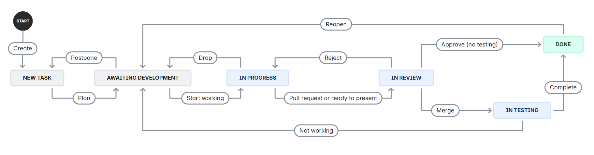
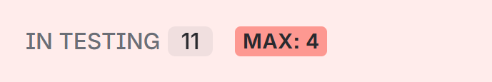

# :bar_chart: Jira Workflow :bar_chart:

Let others know what you're working on (or pretending to).

## Content
- [Task Basics](#task-basics)
  - [Creation Rules](#creation-rules)
  - [Labels](#labels)
- [Board Overview](#board-overview)
  - [States](#states)
  - [Transitions](#transitions)
  - [Limits](#limits)

## Task Basics

### Creation Rules
- Title (also known as summary) should be short but clear, so everyone can understand the main idea without opening the description (e.g.: "Fix loading spinner in mid-scene screen", not "Fix spinner").
- Description must include extra context for the person working on the task: what exactly needs to be done, expected results, any links, screenshots, or design references if applicable.
- If the task is quite big and involves multiple small things, use checkboxes in the description to list them. However if it’s huge, consider splitting it into subtasks instead.
- Ideally tasks should be added to an epic if possible, but if no fitting epic exists - that’s okay too.
- The Assignee field may be left empty only while the task is still new. As soon as the task moves to "Awaiting Development" or further, it must have someone assigned. If you're working on something - don't forget to assign yourself.

### Labels

Each task must have AT LEAST one label assigned. If multiple labels fit - select all that apply, but be sure they do reflect the primary goal and purpose of the task.

| **LABEL**        | **MEANING AND USAGE**                                                       |
|------------------:|-----------------------------------------------------------------------------|
| `Bug`            | A fix for unintended or broken functionality.                               |
| `Feature`        | A new feature or major addition to the existing functionality.              |
| `Refactor`       | Code update or improvement usually with no behavior change.                 |
| `Cleanup`        | Code or asset cleanup WITHOUT ANY CHANGES in functionality.                 |
| `Optimization`   | Performance-related improvements only (both code and assets).               |
| `Audio`          | Anything related to music, sound effects, or audio systems.                 |
| `UI`             | User interface work: layout, visual design, interactions.                   |
| `Design`         | UI/UX design work or interaction flows.                                     |
| `Balance`        | Gameplay balancing: tuning numbers, mechanics, or difficulty.               |
| `Testing`        | Relates to testing new approach or existing feature validation.             |
| `Tech`           | Low-level technical tasks and backend (e.g. database management).           |
| `DevOps`         | Overall infrastructure: CI/CD, deployment, builds, etc.                     |
| `Documentation`  | Architecture, planning, in-code comments, README updates, guides.           |

Any labels that aren't listed above are NOT allowed. :kissing_heart:  
If none of the labels describes the purpose of your task - ask [@vyshnovka](https://github.com/vyshnovka).

## Board Overview

### States

| **STATUS**              | **DESCRIPTION**                                                                 |
|:------------------------:|---------------------------------------------------------------------------------|
| New Task           | A newly created task that has been approved and prioritized for the nearest future.                            |
| Awaiting Development | Chosen task is ready to be picked up for work as the next item.               |
| In Progress        | The task is being actively worked on at the moment.                                     |
| In Review          | For code: pull request has been created and is under review.   For no-code: assets/documents are finished and being verified.                        |
| In Testing         | For code: pull request has been merged and needs to be tested.   For no-code: some planning-related tasks (e.g. design or documentation) can skip this stage.  |
| Done               | Task has passed all reviews and testing, no further action is needed.       |

### Transitions

Movement between states is called transition. Each transition has its own purpose/specific timing that needs to be followed.

Tasks may be moved forward (as they should) and backward (if issues are found or next stage is impossible to complete).

### Limits

Each column (status) has a recommended maximum number of tasks. These limits are not strict, but preferred and encouraged to be followed unless necessary. When a column exceeds the max, it turns red.

Try to move tasks forward (or backward :disappointed:) before pulling in more.